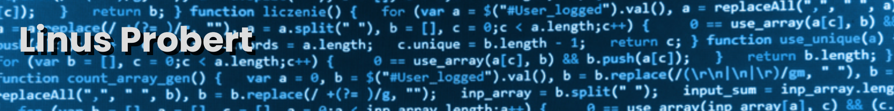

Hi, my name is Linus Probert.

I'm a professional software developer since 2010 with a degree in Computer Science. My working experience has consisted of fullstack Java development for 8+ years and as the internet has evolved this has transitioned into fullstack with a backend of whatever architecture and language suits the project (Nodejs, Python, Java, AWS, GCP, Azure) and frontend in something suitable. Commonly Vuejs, Angular or React. Currently I work with embedded applications in the automotive industry using C/C++.

My spare time is mostly dedicated to family and hobby projects. Currently most of my 'spare' time is dedicated to [Blightmud](https://github.com/blightmud/blightmud) and improving my skills in Rust, C/C++.

### My tech stack (What I have professional experience in)
---

### Social
---

  
### My github stats
---

<!-- ](https://github.com/anuraghazra/github-readme-stats) -->

<!--
**LiquidityC/LiquidityC** is a ✨ _special_ ✨ repository because its `README.md` (this file) appears on your GitHub profile.

Here are some ideas to get you started:

- 🔭 I’m currently working on ...
- 🌱 I’m currently learning ...
- 👯 I’m looking to collaborate on ...
- 🤔 I’m looking for help with ...
- 💬 Ask me about ...
- 📫 How to reach me: ...
- 😄 Pronouns: ...
- ⚡ Fun fact: ...
-->
